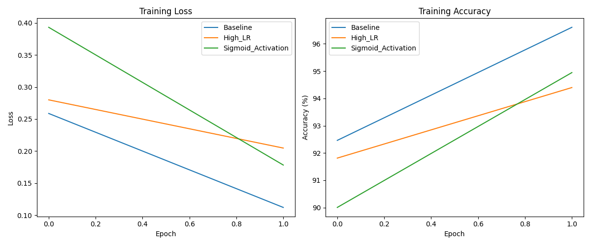

# Neural Networks Course Project: Handwritten Digit Recognition (MNIST)

## 1. Problem Description
This project implements a Multilayer Perceptron (MLP) for handwritten digit recognition using the MNIST dataset. The goal is to classify grayscale images of handwritten digits (0-9) into their respective categories.

## 2. Dataset
The MNIST dataset is used for this project. It consists of 60,000 training images and 10,000 testing images. Each image is 28x28 pixels. The dataset is automatically downloaded and preprocessed (normalization) by the `train.py` script using `torchvision.datasets.MNIST`.

**Dataset Link:** The MNIST dataset is publicly available and can be accessed via PyTorch's `torchvision` library. More information can be found [here](http://yann.lecun.com/exdb/mnist/).

## 3. Model Architecture
The implemented model is a Multilayer Perceptron (MLP) with the following architecture:
- **Input Layer:** 784 neurons (corresponding to the 28x28 pixel input images).
- **Hidden Layer:** A single hidden layer with a configurable number of neurons (defaulting to 128).
- **Output Layer:** 10 neurons (one for each digit class, 0-9).

Different activation functions (ReLU, Tanh, Sigmoid) can be used in the hidden layer. The output layer uses a linear activation followed by `CrossEntropyLoss` for classification.

## 4. Experiments and Results
Three experiments were conducted by varying the learning rate and activation function to observe their impact on model performance. Each experiment was run for 2 epochs.

### Experiment Parameters:

| Experiment Name      | Hidden Layer Size | Learning Rate | Activation Function |
|----------------------|-------------------|---------------|---------------------|
| Baseline             | 128               | 0.001         | ReLU                |
| High_LR              | 128               | 0.01          | ReLU                |
| Sigmoid_Activation   | 128               | 0.001         | Sigmoid             |

### Performance Comparison:

| Experiment           | Test Loss | Test Accuracy | Test MSE | Activation | Learning Rate |
|----------------------|-----------|---------------|----------|------------|---------------|
| Baseline             | 0.1025    | 96.95%        | 0.0047   | relu       | 0.001         |
| High_LR              | 0.2130    | 93.85%        | 0.0092   | relu       | 0.01          |
| Sigmoid_Activation   | 0.1523    | 95.55%        | 0.0068   | sigmoid    | 0.001         |

**Analysis:**
- The **Baseline** experiment with a learning rate of 0.001 and ReLU activation achieved the highest accuracy and lowest loss, indicating good performance.
- The **High_LR** experiment with a learning rate of 0.01 showed a significantly higher loss and lower accuracy, suggesting that a higher learning rate can lead to unstable training and suboptimal performance for this model and dataset.
- The **Sigmoid_Activation** experiment, while performing better than the `High_LR` experiment, did not surpass the `Baseline` experiment in terms of accuracy and loss. This suggests that ReLU might be a more suitable activation function for this specific task and model architecture compared to Sigmoid.

## 5. Visualizations
The following plot illustrates the training loss and accuracy curves for all experiments:

## 6. Code Organization
- `mnist_project/`
  - `data/`: Contains the downloaded MNIST dataset.
  - `results/`: Stores experiment results (JSON files) and visualization plots (PNG).
  - `src/`:
    - `model.py`: Defines the MLP model architecture.
    - `train.py`: Handles data loading, model training, evaluation, and experiment execution.
    - `visualize.py`: Generates plots and summary tables from experiment results.
  - `README.md`: This file.
